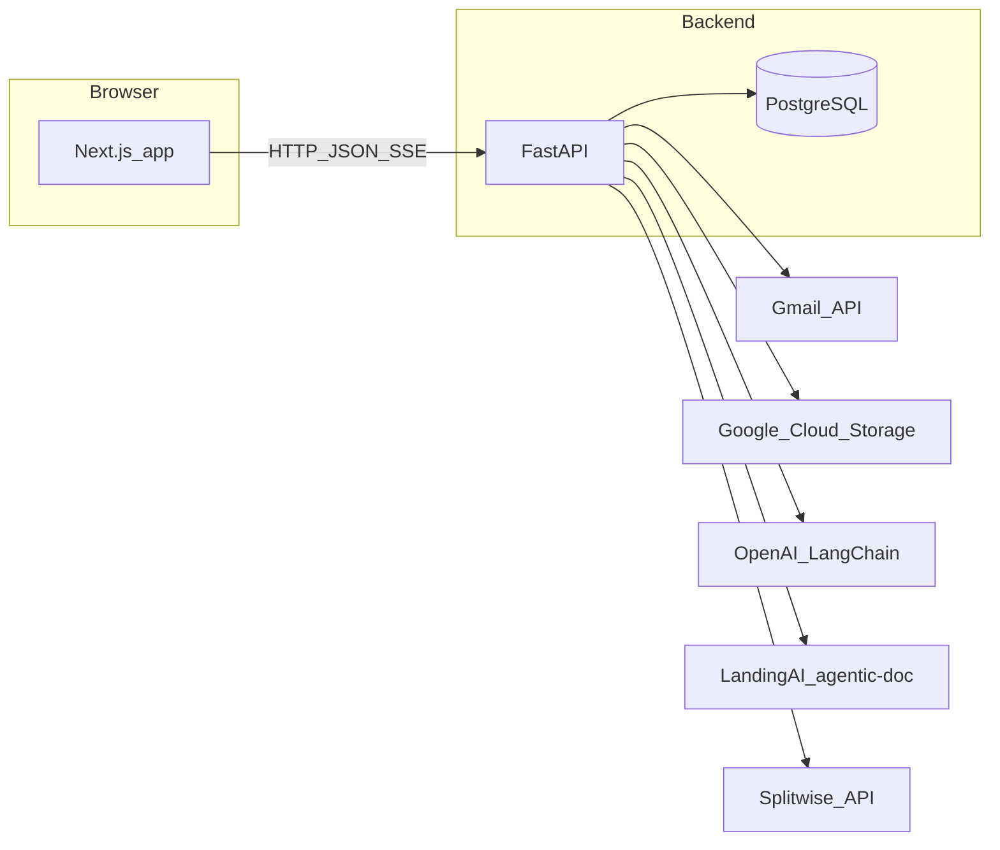

# Expense Tracker

A personal expense-tracking application that ingests transactions from bank statements (via Gmail), enriches them with LLM-assisted extraction, syncs shared expenses from Splitwise, and provides a web UI for review, analytics, settlements, and budgeting.

**Non-goals:** This is a single-user / personal deployment (not multi-tenant SaaS). Authentication and authorization are not modeled as a product feature in the API surface described here.

## Features

- **Transactions:** List with filters, sorting, infinite scroll, inline edits, bulk updates, soft delete, splits (equal/custom), group expenses and transfers, refund/reversal linking, transfer and refund suggestions, category prediction, field-value autocomplete.
- **Statement workflow:** Run a pipeline job that pulls statement PDFs from Gmail, unlocks them, extracts rows (agentic-doc / LandingAI + standardization), writes to PostgreSQL, and uploads artifacts to Google Cloud Storage. Progress is streamed over **Server-Sent Events (SSE)**.
- **Settlements:** Compute who owes whom from shared transactions using `split_breakdown` JSON on each transaction (see [backend README](backend/README.md)).
- **Participants & Splitwise:** Manage people in splits; optional Splitwise IDs on participants. Live Splitwise friend/expense proxy endpoints for the UI.
- **Categories & tags:** Hierarchical categories and tags with CRUD and search; used across the transaction UI.
- **Analytics:** Expense analytics API consumed by charts in the app.
- **Review queue:** UI for transactions that need human review (flags/uncertainty).
- **Budgets (UI):** The frontend includes budget screens and API client methods for `/budgets`. **There is no budgets router mounted in the backend yet** — those calls will fail until a backend implementation is added. See [Known gaps](#known-gaps).

## Architecture



- **Frontend** ([frontend/README.md](frontend/README.md)): Next.js 15 (App Router), React 19, TanStack Query, Tailwind CSS 4, Radix/shadcn-style UI. Default dev URL: `http://localhost:3000`.
- **Backend** ([backend/README.md](backend/README.md)): FastAPI, SQLAlchemy 2 async, Alembic, asyncpg. Default dev URL: `http://localhost:8000`. Interactive API docs: `http://localhost:8000/docs`.
- **Integration:** The frontend sets `NEXT_PUBLIC_API_URL` (default `http://localhost:8000/api`) so all JSON requests go to the `/api` prefix. CORS is permissive in development (`allow_origins=["*"]` in [backend/main.py](backend/main.py)).

## Repository layout

| Path | Role |
|------|------|
| [backend/](backend/) | FastAPI app, Poetry, Alembic migrations, statement pipeline, Gmail/GCS/Splitwise integrations |
| [frontend/](frontend/) | Next.js app, npm, UI and API client |
| [backend/configs/](backend/configs/) | `.env` and optional `secrets/` overrides (see backend README) |
| [backend/data/](backend/data/) | Downloaded statements, extracted CSVs, backups (runtime data — not all committed) |
| [backend/scripts/](backend/scripts/) | Operational and one-off Python/shell scripts |
| [CLAUDE.md](CLAUDE.md) | Concise contributor-oriented overview (AI tooling) |

## Prerequisites

- **PostgreSQL** (local or Docker) — default database name in code and `alembic.ini` is `expense_tracker` (you can use another name if you align `DB_NAME` and Alembic).
- **Python 3.11+** and **[Poetry](https://python-poetry.org/)** for the backend.
- **Node.js 20+** recommended (matches `@types/node` in the frontend; Next.js 15 runs on modern Node).
- **Optional (feature-dependent):**
  - Google Cloud project + bucket + service account for GCS uploads.
  - Gmail OAuth credentials and refresh tokens for email ingestion.
  - `OPENAI_API_KEY` for LLM usage in the pipeline.
  - `VISION_AGENT_API_KEY` (LandingAI / agentic-doc) for PDF extraction.
  - `SPLITWISE_API_KEY` for Splitwise HTTP API routes and workflow sync.

## Quick start

### 1. Clone and database

Create a PostgreSQL database (example name aligned with defaults):

```bash
createdb expense_tracker
# or use your preferred tool / Docker image
```

### 2. Backend

```bash
cd backend
poetry install
# Create backend/configs/.env — see backend/README.md for all variables
# Edit configs/.env: DB_*, secrets as needed
# Optional: configs/secrets/.env (loaded first, overrides)
poetry run alembic upgrade head
poetry run uvicorn main:app --reload
```

API: `http://localhost:8000` — health: `GET /healthz` — docs: `/docs`.

### 3. Frontend

```bash
cd frontend
npm install
cp .env.local.example .env.local
# Defaults usually work for local API; see frontend/README.md
npm run dev
```

App: `http://localhost:3000`.

### 4. Smoke check

- `curl -s http://localhost:8000/healthz`
- Open `http://localhost:8000/docs` and confirm routers appear.
- Open the web app and navigate to **Transactions** (requires DB reachable).

## Configuration at a glance

| Variable / topic | Where | Purpose |
|------------------|--------|---------|
| `DB_*`, Gmail, GCS, OpenAI, Sentry, `CURRENT_USER_NAMES` | [backend/configs/](backend/configs/) via [backend/src/utils/settings.py](backend/src/utils/settings.py) | Backend runtime |
| `VISION_AGENT_API_KEY`, `SPLITWISE_API_KEY` | Environment (often same `.env` files) | Extraction + Splitwise client (not all in Pydantic `Settings`) |
| `NEXT_PUBLIC_API_URL`, `NEXT_PUBLIC_APP_ENV` | [frontend/.env.local](frontend/.env.local) | API base URL and optional environment label |

Full tables: [backend/README.md](backend/README.md), [frontend/README.md](frontend/README.md).

## Key workflows

### Statement processing (high level)

1. **Trigger:** `POST /api/workflow/run` with mode and date options (see OpenAPI).
2. **Pipeline:** Gmail → download PDF → unlock with per-account password → page filter → **agentic-doc** extraction → CSV → optional GCS upload → **TransactionStandardizer** → PostgreSQL; **StatementProcessingLog** tracks per-file status.
3. **Progress:** `GET /api/workflow/{job_id}/stream` (SSE) for live events; `GET /api/workflow/{job_id}/status` for polling.

Implementation entry: [backend/src/services/orchestrator/statement_workflow.py](backend/src/services/orchestrator/statement_workflow.py).

**Concurrency:** Only one workflow job runs at a time (enforced in workflow routes); job state is in-memory and does not survive API restarts.

### Settlements

Balances are computed in Python from transactions that carry `split_breakdown` (and related fields). The current user is inferred using `CURRENT_USER_NAMES` and account metadata. Details: [backend/README.md](backend/README.md).

## Development

- **Hot reload:** Backend uses Uvicorn `--reload`; frontend uses Next.js with Turbopack. After normal code edits, servers pick up changes without a manual restart. Restart when changing dependency manifests (`pyproject.toml`, `package.json`) or environment files, or when the process crashes.
- **Backend tests:** From `backend/`: `poetry run pytest tests/`
- **Backend lint:** `poetry run ruff check .`
- **Frontend lint:** From `frontend/`: `npm run lint`
- **Frontend typecheck:** `npm run type-check` (strict `tsc`; may surface known debt — see [frontend/README.md](frontend/README.md))

## Production notes (brief)

- **Frontend:** `npm run build` then `npm run start` (or host static output per your platform).
- **Backend:** Run Uvicorn (or Gunicorn with Uvicorn workers) behind a reverse proxy; set all secrets via environment; run `alembic upgrade head` before or as part of deploy.
- **Database:** Use a managed PostgreSQL instance; tune connection pool in [backend/src/services/database_manager/connection.py](backend/src/services/database_manager/connection.py) if needed.

## Troubleshooting

| Symptom | Things to check |
|---------|-----------------|
| DB connection errors | `DB_HOST`, `DB_PORT`, `DB_NAME`, `DB_USER`, `DB_PASSWORD`; PostgreSQL running; database created |
| Alembic vs app mismatch | [backend/alembic.ini](backend/alembic.ini) `sqlalchemy.url` must point at the same DB you configure in `.env` (Alembic uses sync `postgresql://`; the app uses async `postgresql+asyncpg://` built from `DB_*`) |
| 404 on `/budgets` | Expected until backend budgets API exists — see [Known gaps](#known-gaps) |
| Statement extraction fails | `VISION_AGENT_API_KEY`, PDF unlock password on `accounts`, Gmail tokens |
| Splitwise errors | `SPLITWISE_API_KEY` set for routes that instantiate [SplitwiseAPIClient](backend/src/services/splitwise_processor/client.py) |

## Known gaps

- **Budgets API:** The frontend [ApiClient](frontend/src/lib/api/client.ts) calls `/budgets` endpoints. The FastAPI app in [backend/main.py](backend/main.py) does not mount a budgets router yet. Budget UI may error at runtime until the backend is implemented or the client is adjusted.

## License

Private / personal project unless you add a license file.
