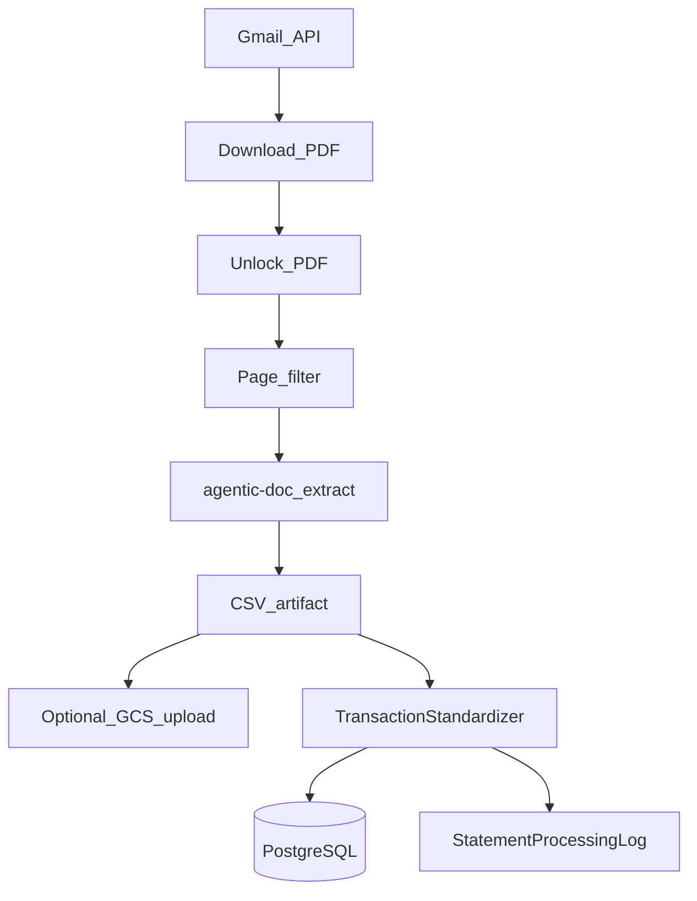

# Expense Tracker Backend

FastAPI service for a personal expense tracker: PostgreSQL persistence, Gmail-based statement ingestion, LLM and agentic-doc PDF extraction, Google Cloud Storage for artifacts, and Splitwise integration.

**Commands in this document are run from the `backend/` directory** (where `pyproject.toml` lives).

## Stack

| Layer | Technology |
|-------|------------|
| API | FastAPI, Uvicorn |
| ORM / DB | SQLAlchemy 2.x async, asyncpg, PostgreSQL |
| Migrations | Alembic |
| Validation / settings | Pydantic v2, pydantic-settings |
| LLM | LangChain, OpenAI |
| PDF / extraction | PyMuPDF, Pillow, pytesseract, **agentic-doc** (LandingAI) |
| Email | Google Gmail API (google-api-python-client, OAuth) |
| Object storage | Google Cloud Storage |
| Splits | Splitwise HTTP API (`splitwise` package + `requests`) |
| Tests | pytest, pytest-asyncio |
| Lint | ruff |

Python: **3.11+** (see [pyproject.toml](pyproject.toml)).

## Directory layout

```
backend/
├── main.py                          # FastAPI app, CORS, router mounts
├── pyproject.toml                   # Poetry dependencies
├── alembic.ini                      # Alembic config (sync DB URL for migrations)
├── configs/
│   ├── .env                         # Primary config (not committed if gitignored)
│   └── secrets/
│       └── .env                     # Optional overrides (loaded first)
├── data/                            # Runtime data (statements, CSVs, backups)
├── logs/                            # Rotating logs (if configured)
├── scripts/                         # Operational / one-off scripts
├── src/
│   ├── apis/
│   │   ├── routes/                  # FastAPI routers
│   │   └── schemas/                 # Pydantic request/response models
│   ├── services/
│   │   ├── database_manager/        # Models, connection, operations, migrations
│   │   ├── orchestrator/            # statement_workflow, standardizer, CSV
│   │   ├── email_ingestion/         # Gmail OAuth, fetch, tokens
│   │   ├── statement_processor/     # unlock, page filter, document_extractor
│   │   ├── ocr_engine/
│   │   ├── splitwise_processor/
│   │   └── cloud_storage/           # GCS
│   └── utils/                       # settings, logger, helpers
└── tests/
```

## Setup

```bash
cd backend
poetry install
```

Create a PostgreSQL database. The **default** application settings use database name **`expense_tracker`** ([src/utils/settings.py](src/utils/settings.py)). Your local [alembic.ini](alembic.ini) `sqlalchemy.url` should target the same database you configure with `DB_*` variables.

```bash
# Example (adjust user/host)
createdb expense_tracker
```

## Configuration

### Load order

[Settings](src/utils/settings.py) lists both `configs/secrets/.env` and `configs/.env` in `SettingsConfigDict.env_file`. Pydantic Settings merges these with normal precedence rules (environment variables and later file entries can override earlier ones depending on key). Use `configs/secrets/.env` for machine-specific secrets and `configs/.env` for shared defaults, and verify behavior if you duplicate keys across files.

### Settings registered in Pydantic (`Settings`)

| Variable | Purpose |
|----------|---------|
| `APP_ENV` | Environment label (default `dev`) |
| `APP_NAME` | Application name |
| `LOG_LEVEL` | Logging level |
| `OPENAI_API_KEY` | OpenAI API for LangChain / LLM features |
| `DB_HOST`, `DB_PORT`, `DB_NAME`, `DB_USER`, `DB_PASSWORD` | PostgreSQL; async URL built as `postgresql+asyncpg://...` |
| `GOOGLE_CLIENT_ID`, `GOOGLE_CLIENT_SECRET`, `GOOGLE_REFRESH_TOKEN`, `GOOGLE_PROJECT_ID`, `GOOGLE_REDIRECT_URI`, `GOOGLE_CLIENT_SECRET_FILE` | Primary Gmail OAuth |
| `GOOGLE_CLIENT_ID_2`, `GOOGLE_CLIENT_SECRET_2`, `GOOGLE_REFRESH_TOKEN_2`, `GOOGLE_CLIENT_SECRET_FILE_2` | Secondary Gmail account (optional) |
| `GOOGLE_CLOUD_PROJECT_ID`, `GOOGLE_CLOUD_BUCKET_NAME`, `GOOGLE_APPLICATION_CREDENTIALS` | GCS |
| `CURRENT_USER_NAMES` | Comma-separated names treated as “you” for settlements (e.g. `me,chaitanya`) |
| `SENTRY_DSN` | Optional error reporting |

### Additional environment variables (read outside `Settings` or optional)

| Variable | Purpose |
|----------|---------|
| `VISION_AGENT_API_KEY` | **Required** for [document_extractor.py](src/services/statement_processor/document_extractor.py) agentic-doc (LandingAI) PDF extraction |
| `SPLITWISE_API_KEY` | **Required** for [SplitwiseAPIClient](src/services/splitwise_processor/client.py) and Splitwise proxy routes |
| `GOOGLE_APPLICATION_CREDENTIALS` | Path to GCS service account JSON (often duplicated in `Settings` for clarity) |

**Note:** There is **no** Redis or `REDIS_URL` in current settings; do not rely on a Redis URL unless you add it.

## Running the API

### Development

```bash
poetry run uvicorn main:app --reload
```

- Base URL: `http://localhost:8000`
- **Health:** `GET /healthz` → `{"status":"ok"}`
- **OpenAPI:** `GET /docs` (Swagger UI), `GET /redoc`

### Production-style

Use a production ASGI server configuration (e.g. Uvicorn with multiple workers or behind Gunicorn), set `APP_ENV` and secrets via environment, and run migrations before traffic.

## API surface (routers)

All paths below are relative to the server origin. **Authoritative list:** `http://localhost:8000/docs`.

| Mount in [main.py](main.py) | Router prefix | Example full path |
|-----------------------------|---------------|-------------------|
| `/api` + `transaction_router` | `/transactions` | `/api/transactions/` |
| `/api` + `settlement_router` | `/settlements` | `/api/settlements/...` |
| `/api` + `participant_router` | `/participants` | `/api/participants/...` |
| `/api` + `workflow_router` | `/workflow` | `/api/workflow/run` |
| `/api/splitwise` + `splitwise_router` | (none) | `/api/splitwise/friends` |

### Transactions (`/api/transactions`)

Single large router: CRUD, list with filters, search, bulk update, split/group operations, categories, tags, analytics, suggestions (transfers/refunds/summary), predict category, field values, email search/link/unlink, source PDF, related transactions, children, group membership, etc. See [transaction_routes.py](src/apis/routes/transaction_routes.py) and OpenAPI.

### Settlements (`/api/settlements`)

Summary, detail, participant-level balances — computed from stored transactions and `split_breakdown`. See [settlement_routes.py](src/apis/routes/settlement_routes.py).

### Participants (`/api/participants`)

CRUD and search for split participants (optional `splitwise_id` / `splitwise_email`). See [participant_routes.py](src/apis/routes/participant_routes.py).

### Workflow (`/api/workflow`)

| Method | Path | Description |
|--------|------|-------------|
| POST | `/run` | Start pipeline job; returns `job_id` (409 if a job is already running) |
| POST | `/{job_id}/cancel` | Cancel job |
| GET | `/active` | Current active job or null |
| GET | `/period-check` | Period completeness check |
| GET | `/{job_id}/stream` | **SSE** stream of workflow events |
| GET | `/{job_id}/status` | Job status and event log |

See [workflow_routes.py](src/apis/routes/workflow_routes.py).

**Behavior:** Only one workflow job at a time; state is **in-memory** (lost on process restart).

### Splitwise (`/api/splitwise`)

Live proxy to Splitwise (no local DB cache for these endpoints):

- `GET /friends` — friends with net balances
- `GET /friend/{splitwise_id}/expenses` — expenses for a friend

Requires `SPLITWISE_API_KEY`. See [splitwise_routes.py](src/apis/routes/splitwise_routes.py).

## Service layer (concise)

- **`database_manager`:** Async engine and session factory ([connection.py](src/services/database_manager/connection.py)); consolidated queries in [operations.py](src/services/database_manager/operations.py); SQLAlchemy models under `models/`; Alembic under `migrations/`.
- **`orchestrator/statement_workflow.py`:** Orchestrates full and partial runs (e.g. Splitwise-only, resume). Modes documented in code and workflow schemas.
- **`email_ingestion`:** Gmail OAuth, token refresh, message download.
- **`statement_processor`:** PDF unlock ([pdf_unlocker.py](src/services/statement_processor/pdf_unlocker.py)), page filter, [document_extractor.py](src/services/statement_processor/document_extractor.py) (agentic-doc).
- **`splitwise_processor`:** Sync and API client for Splitwise data used in workflows.
- **`cloud_storage/gcs_service.py`:** Upload/download paths for statements and CSVs.
- **Logging:** `from src.utils.logger import get_logger` — rotating files + console; job-aware logging where configured.

## Statement processing pipeline



Triggered via **`POST /api/workflow/run`**. Progress: **`GET /api/workflow/{job_id}/stream`** (SSE).

## Database

- **Migrations:** From `backend/`:

  ```bash
  poetry run alembic upgrade head
  poetry run alembic revision --autogenerate -m "description"
  ```

- **Alembic URL:** [alembic.ini](alembic.ini) uses a **synchronous** `postgresql://` URL for Alembic’s CLI. The running app uses **async** `postgresql+asyncpg://` from `Settings.DATABASE_URL`. Keep both pointed at the same logical database.

### Main models (conceptual)

- **Transaction** — amounts, account, category, tags, `split_breakdown` JSONB, `related_mails`, `transaction_source`, soft delete, grouping fields.
- **Account** — bank/card; `statement_sender` / password for ingestion.
- **Category** — hierarchical (`parent_id`), `transaction_type` filter.
- **Tag**, **Participant**, **StatementProcessingLog**, etc. See `src/services/database_manager/models/`.

Migrations live in `src/services/database_manager/migrations/versions/`.

## Data directories (`data/`)

Typical contents (exact layout may vary by run):

- **Statements:** locked/unlocked PDFs under `data/statements/` or paths configured in workflow.
- **Extracted CSVs** for reprocessing / resume.
- **Backups** under `data/backups/` if you dump DB here.

Safe to delete **only** what you know is disposable (e.g. re-downloadable statement PDFs); keep backups you care about.

## Testing and quality

```bash
poetry run pytest tests/
poetry run pytest tests/test_api_integration.py   # example single file
poetry run ruff check .
```

Tests live under [tests/](tests/); shared fixtures may use [conftest.py](tests/conftest.py) if present.

## Scripts ([scripts/](scripts/))

| Script | Purpose (high level) |
|--------|----------------------|
| `fetch_emails.py` | Gmail fetch utilities |
| `process_statement.py` | Standalone PDF processing with agentic-doc |
| `run_statement_processing_workflow.py` | Workflow runner |
| `run_workflow_with_resume.py` | Resume-oriented workflow |
| `manage_bank_passwords.py` | Account/password maintenance |
| `monitor_gmail_tokens.py` | Token health |
| `regenerate_both_accounts.py` | Gmail account regeneration |
| `setup_secondary_email.py` | Secondary Gmail setup |
| `test_page_filter.py` | Page filter testing |
| `manage_cloud_sql_instance.sh` | Cloud SQL ops |

Run with `poetry run python scripts/<name>.py` from `backend/` unless the script documents otherwise.

## Troubleshooting

| Issue | What to check |
|-------|----------------|
| `No module named 'src'` | Run from `backend/`; use `poetry run` |
| Alembic cannot connect | `sqlalchemy.url` in `alembic.ini` vs running PostgreSQL |
| App cannot connect | `DB_*` in `.env`; database created; firewall |
| Extraction returns empty / errors | `VISION_AGENT_API_KEY`; unlocked PDF path; account nickname mapping in extractor |
| Splitwise 500 / client error | `SPLITWISE_API_KEY` |
| Gmail errors | OAuth files, refresh tokens, API enablement in Google Cloud |

## Related docs

- [Root README](../README.md) — full-stack setup
- [CLAUDE.md](CLAUDE.md) — contributor-oriented backend map
