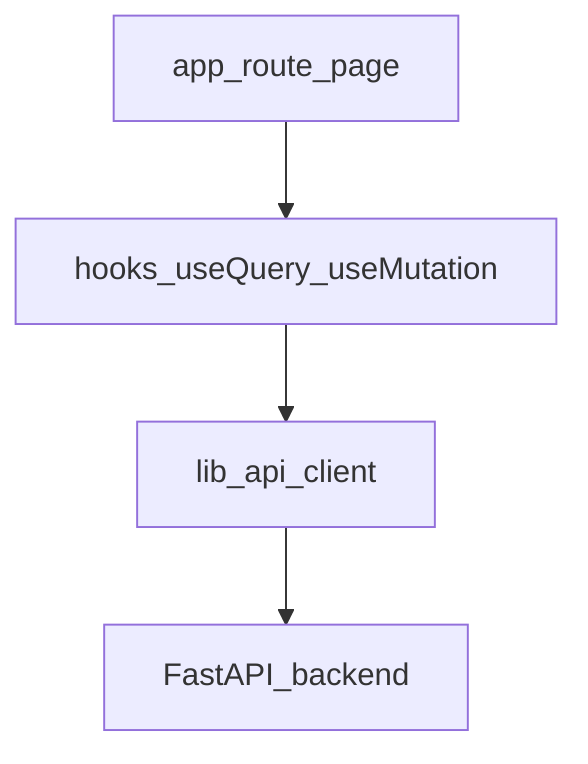

# Expense Tracker Frontend

Next.js web client for the Expense Tracker: transactions, settlements, analytics, budgets UI, statement workflow (SSE), review queue, and settings (categories and tags).

**Run all npm commands from the `frontend/` directory** (where `package.json` lives).

## Stack

| Area | Technology |
|------|------------|
| Framework | Next.js 15 (App Router), React 19 |
| Language | TypeScript (strict) |
| Styling | Tailwind CSS 4, PostCSS, CSS variables (OkLCH theme in `src/app/globals.css`) |
| UI primitives | Radix UI, shadcn-style components (`components.json`, `src/components/ui/`) |
| Server state | TanStack React Query |
| Tables | TanStack Table + virtualization (`@tanstack/react-virtual`) |
| Charts | Recharts |
| Forms | React Hook Form + Zod |
| Icons | Lucide React |
| Theming | next-themes (light / dark / system) |
| Toasts | sonner |
| Motion | Framer Motion |
| PDF preview | react-pdf / pdfjs-dist |
| Bundler (dev) | Turbopack (`next dev --turbopack`) |

## Prerequisites

- **Node.js 20+** recommended (aligned with `@types/node` and Next.js 15).
- Running **backend API** (default `http://localhost:8000`) — see [../README.md](../README.md).

## Getting started

```bash
cd frontend
npm install
cp .env.local.example .env.local
npm run dev
```

Open [http://localhost:3000](http://localhost:3000).

### Environment variables

Create `.env.local` (see [.env.local.example](.env.local.example)):

| Variable | Required | Description |
|----------|----------|-------------|
| `NEXT_PUBLIC_API_URL` | No | Base URL for JSON API calls. **Default:** `http://localhost:8000/api`. Must include the `/api` segment because the FastAPI app mounts routers under `/api`. |
| `NEXT_PUBLIC_APP_ENV` | No | Optional environment label (e.g. `development`). Reserved for future use or logging; not required for local dev. |

The singleton client reads the base URL in [src/lib/api/client.ts](src/lib/api/client.ts):

```ts
const API_BASE_URL = process.env.NEXT_PUBLIC_API_URL || "http://localhost:8000/api";
```

## Scripts

| Script | Command | Description |
|--------|---------|-------------|
| Dev | `npm run dev` | Next.js dev server with Turbopack (default port 3000) |
| Build | `npm run build` | Production build (Turbopack) |
| Start | `npm run start` | Serve production build |
| Lint | `npm run lint` | ESLint (Next.js config) |
| Typecheck | `npm run type-check` | `tsc --noEmit` (no JS output). The repo may still report errors in some files until types are aligned; `npm run build` is the main production gate (Next.js runs its own checks during build). |

## Project structure

```
frontend/
├── next.config.ts
├── package.json
├── postcss.config.mjs
├── tsconfig.json
├── components.json              # shadcn/ui config
├── public/
└── src/
    ├── app/                     # App Router: layouts, pages, globals.css
    │   ├── layout.tsx
    │   ├── page.tsx             # Root redirect
    │   ├── globals.css          # Tailwind + theme tokens (OkLCH)
    │   ├── transactions/
    │   ├── settlements/
    │   ├── analytics/
    │   ├── budgets/
    │   ├── review/
    │   └── settings/
    ├── components/
    │   ├── providers.tsx        # React Query + ThemeProvider + Toaster
    │   ├── layout/              # Shell, navigation
    │   ├── transactions/        # Table, filters, modals, drawers, PDF, email
    │   ├── settlements/
    │   ├── analytics/
    │   ├── budgets/
    │   ├── review/
    │   ├── settings/
    │   ├── split-editor/
    │   ├── workflow/            # SSE workflow sheet
    │   └── ui/                  # Radix primitives + modal helpers
    ├── hooks/                   # use-* hooks wrapping React Query
    ├── lib/
    │   ├── api/client.ts        # All HTTP calls (singleton)
    │   ├── types/index.ts       # TS models matching backend DTOs
    │   ├── format-utils.ts      # formatCurrency, formatDate (SSR-safe)
    │   ├── utils.ts             # cn() helper
    │   └── workflow-tasks.ts    # SSE events → task tree
    └── store/                   # (optional local state)
```

## Architecture and data flow



- **Single API client:** All backend access goes through [src/lib/api/client.ts](src/lib/api/client.ts). Do not scatter `fetch` in feature code unless you have a strong reason.
- **Hooks:** Each domain has `use-*.ts` files under [src/hooks/](src/hooks/) wrapping `useQuery` / `useMutation` / `useInfiniteQuery` with stable `queryKey`s and cache invalidation on mutations.
- **Providers:** [src/components/providers.tsx](src/components/providers.tsx) wraps the app with:
  - `QueryClientProvider` (default stale time **60s**, **1** retry on queries)
  - `ThemeProvider` (next-themes, class-based dark mode)
  - `Toaster` (sonner, top-right, rich colors)

## Routes and main UI

| Route | Primary UI |
|-------|------------|
| `/transactions` | Virtualized table, filters, stats, inline edit, bulk actions, splits, grouping, email/PDF drawers |
| `/settlements` | Summary cards, tabbed detail (implementation in `settlements/page.tsx` and components) |
| `/analytics` | Charts and filters (`analytics-*` components) |
| `/budgets` | Budget overview and list; **requires backend `/budgets` API** — not implemented in FastAPI yet (see [../README.md](../README.md)) |
| `/review` | Review queue for uncertain transactions |
| `/settings` | Categories and tags managers (tabs) |

Root [src/app/page.tsx](src/app/page.tsx) typically redirects to the main experience (e.g. transactions).

## API client method groups

The `ApiClient` class in [client.ts](src/lib/api/client.ts) is grouped roughly as:

- **Transactions:** list (filters/sort/pagination), CRUD, bulk update, split, group expense/transfer, ungroup, related/group/children, suggestions, analytics, predict category, field values, search.
- **Categories / tags:** CRUD, search, upsert.
- **Settlements:** summary, detail, participants.
- **Workflow:** start, cancel, status, stream (SSE), period check, active job.
- **Accounts / participants:** as exposed by backend.
- **Emails:** search, link, unlink, fetch email body, source PDF.
- **Splitwise:** friends, friend expenses (proxy API).
- **Budgets:** create, read, update, delete — **backend routes may be missing**; expect errors until implemented.

Authoritative HTTP contract: [http://localhost:8000/docs](http://localhost:8000/docs).

## Hooks

Key files:

- `use-transactions.ts` — transactions, infinite list, bulk updates, mutations.
- `use-categories.ts`, `use-tags.ts`, `use-accounts.ts`, `use-participants.ts`
- `use-settlements.ts`
- `use-workflow.ts` — workflow job + SSE stream (`EventSource`).
- `use-analytics.ts`, `use-budgets.ts`
- `use-debounce.ts`

Patterns: `queryKey` includes filter objects where relevant; `onSuccess` invalidates related queries (e.g. after creating a transaction).

## Types

Canonical interfaces live in [src/lib/types/index.ts](src/lib/types/index.ts): `Transaction`, `SplitBreakdown`, `TransactionFilters`, settlement types, analytics, workflow, email metadata, etc. Keep these aligned with backend Pydantic schemas when you change APIs.

## UI conventions

- **Classes:** Use `cn()` from [src/lib/utils.ts](src/lib/utils.ts) (`clsx` + `tailwind-merge`).
- **Money / dates:** Use `formatCurrency` and `formatDate` from [src/lib/format-utils.ts](src/lib/format-utils.ts) for consistent display and SSR safety.
- **Icons:** `lucide-react`.
- **Primitives:** Prefer composables under `src/components/ui/` (Radix-based) over raw HTML for interactive controls.
- **Workflow:** [src/lib/workflow-tasks.ts](src/lib/workflow-tasks.ts) turns SSE payloads into a hierarchical task list for [workflow-sheet.tsx](src/components/workflow/workflow-sheet.tsx).

## State

- **Server state:** TanStack Query (source of truth for API data).
- **UI state:** React `useState` / local component state.
- **Filters:** Transaction filters may persist to `localStorage` (see transactions page implementation) for session continuity.

## Styling and theming

- Tailwind v4 via `@tailwindcss/postcss` (no classic `tailwind.config.js` in the repo root — see PostCSS config).
- Theme tokens live in `src/app/globals.css` using **OkLCH** for dark-mode–friendly colors.
- Dark mode: `class` strategy via `next-themes` (toggle in layout/navigation).

## Code style

- Path alias **`@/*`** → `src/*` ([tsconfig.json](tsconfig.json)).
- ESLint with Next.js config (`npm run lint`).
- TypeScript strict mode enabled.

## Troubleshooting

| Issue | What to check |
|-------|----------------|
| `API Error: 404` on budgets | Backend budgets router not implemented — see root README |
| CORS / network errors | Backend running; `NEXT_PUBLIC_API_URL` includes `/api` and matches backend origin |
| Hydration warnings | Date/currency formatting — use `formatDate` / `formatCurrency` helpers |
| SSE workflow stuck | Backend single-job rule; refresh status endpoint; backend logs |

## Related docs

- [Root README](../README.md) — full-stack setup and architecture
- [CLAUDE.md](CLAUDE.md) — contributor-oriented frontend map
